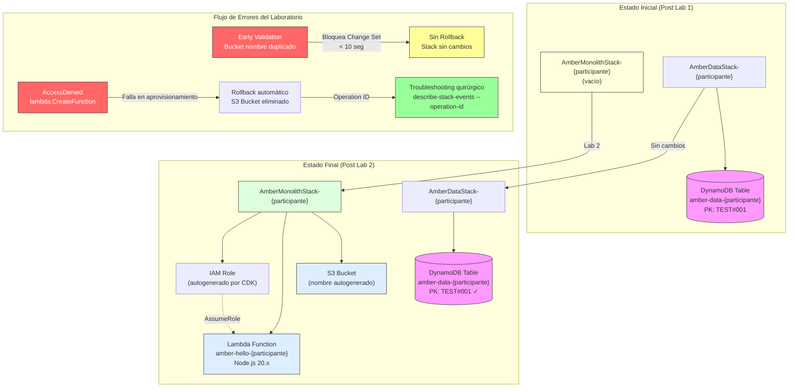

# 🔍 Laboratorio 2: Early Validation & Troubleshooting

## Índice

- [Información del Laboratorio](#información-del-laboratorio)
- [Objetivos de Aprendizaje](#objetivos-de-aprendizaje)
- [Prerrequisitos](#prerrequisitos)
- [Paso 1: Verificar Región y Entorno](#paso-1-verificar-región-y-entorno)
- [Paso 2: Agregar S3 Bucket con Nombre Explícito](#paso-2-agregar-s3-bucket-con-nombre-explícito)
- [Paso 3: Observar Early Validation](#paso-3-observar-early-validation)
- [Paso 4: Corregir Nombre Duplicado](#paso-4-corregir-nombre-duplicado)
- [Paso 5: Agregar Lambda Function](#paso-5-agregar-lambda-function)
- [Paso 6: Restringir Permisos IAM](#paso-6-restringir-permisos-iam)
- [Paso 7: Observar Fallo y Rollback](#paso-7-observar-fallo-y-rollback)
- [Paso 8: Extraer Operation ID](#paso-8-extraer-operation-id)
- [Paso 9: Troubleshooting con Operation ID](#paso-9-troubleshooting-con-operation-id)
- [Paso 10: Restaurar Permisos](#paso-10-restaurar-permisos)
- [Paso 11: Despliegue Exitoso](#paso-11-despliegue-exitoso)
- [Paso 12: Verificar Recursos y Datos](#paso-12-verificar-recursos-y-datos)
- [Arquitectura](#arquitectura)
- [Resumen de Conceptos Aprendidos](#resumen-de-conceptos-aprendidos)
- [Próximo Laboratorio](#próximo-laboratorio)
- [Solución de Problemas](#solución-de-problemas)

---

## Información del Laboratorio

**Tiempo estimado**: 30 minutos

**Método de implementación**: AWS CDK + AWS CLI

**Contexto**: Este es el Laboratorio 2 de 3 en un workshop de 2 horas sobre CloudFormation. Continuaremos trabajando con la infraestructura creada en el Laboratorio 1.

---

## Objetivos de Aprendizaje

Al completar este laboratorio, serás capaz de:

- Utilizar **Early Validation** (oficialmente llamada "Pre-deployment validation") de CloudFormation para interceptar errores de configuración durante la creación del Change Set, antes de que se inicie el aprovisionamiento de recursos físicos
- Aplicar **Operation ID** para realizar troubleshooting quirúrgico, filtrando únicamente los eventos fallidos de una operación específica sin revisar el historial completo del Stack
- Diagnosticar y resolver errores comunes de despliegue (nombres globales duplicados, permisos IAM faltantes) usando técnicas avanzadas de depuración
- Comprender el comportamiento de Rollback automático de CloudFormation cuando un despliegue falla, y cómo los recursos se revierten a su estado anterior estable

**Nota**: AWS documenta esta funcionalidad como "Pre-deployment validation". En este laboratorio usamos el término "Early Validation" por claridad conceptual. Referencia oficial: https://docs.aws.amazon.com/AWSCloudFormation/latest/UserGuide/validate-stack-deployments.html

---

## Prerrequisitos

Antes de comenzar este laboratorio, asegúrate de tener:

- **Laboratorio 1 completado**: El Stack Refactoring debe estar finalizado con `AmberMonolithStack-{nombre-participante}` (vacío) y `AmberDataStack-{nombre-participante}` (con tabla DynamoDB) en estado `CREATE_COMPLETE` o `UPDATE_COMPLETE`. El proyecto CDK del Laboratorio 1 está ubicado en `lab-1-stack-refactoring/cdk-app/`
- **AWS CLI configurado**: Versión 2.x instalada y configurada con credenciales válidas (`aws configure`)
- **CDK bootstrapped**: Tu cuenta y región deben tener el entorno CDK inicializado (`cdk bootstrap`)
- **Node.js 18+**: Instalado y disponible en tu PATH para ejecutar comandos CDK

**Nota**: Este laboratorio reutiliza el proyecto CDK del Laboratorio 1. Navegarás entre el directorio `lab-2-validation-troubleshooting/` (documentación y scripts) y `lab-1-stack-refactoring/cdk-app/` (código CDK) según las instrucciones.

---

## Paso 1: Verificar Región y Entorno

Antes de comenzar, es fundamental confirmar que tu entorno está configurado correctamente y que los recursos del Laboratorio 1 están disponibles.

1. Verifique que está trabajando en la región correcta:
   
   Confirme la región configurada ejecutando:
   ```bash
   aws configure get region
   ```
   
   Si no es la región indicada por el instructor, configure la región correcta:
   ```bash
   aws configure set region us-east-1
   ```
   
   O use el parámetro `--region` en cada comando.

2. Verifique que los Stacks del Laboratorio 1 existen y están en estado estable:
   
   ```bash
   aws cloudformation describe-stacks \
     --stack-name AmberMonolithStack-{nombre-participante} \
     --query 'Stacks[0].StackStatus' \
     --output text
   ```
   
   ```bash
   aws cloudformation describe-stacks \
     --stack-name AmberDataStack-{nombre-participante} \
     --query 'Stacks[0].StackStatus' \
     --output text
   ```
   
   Ambos comandos deben retornar `CREATE_COMPLETE` o `UPDATE_COMPLETE`.

3. Verifique que la tabla DynamoDB del Laboratorio 1 está activa:
   
   ```bash
   aws dynamodb describe-table \
     --table-name amber-data-{nombre-participante} \
     --query 'Table.TableStatus' \
     --output text
   ```
   
   Debe retornar: `ACTIVE`

**✓ Verificación**: Confirme que:
- La región configurada es la correcta
- Ambos Stacks están en estado `CREATE_COMPLETE` o `UPDATE_COMPLETE`
- La tabla DynamoDB está en estado `ACTIVE`

---

## Paso 2: Agregar S3 Bucket con Nombre Explícito

En este paso, agregarás un S3 Bucket al `AmberMonolithStack` con un nombre explícito que ya existe globalmente. Esto provocará un error de Early Validation que observarás en el siguiente paso.

1. Navegue al directorio del proyecto CDK del Laboratorio 1:
   
   ```bash
   cd ../lab-1-stack-refactoring/cdk-app/
   ```

2. Abra el archivo `lib/amber-monolith-stack.ts` en su editor de código.

3. Modifique el archivo para agregar un S3 Bucket con nombre explícito. El archivo debe quedar así:
   
   ```typescript
   import * as cdk from 'aws-cdk-lib';
   import * as s3 from 'aws-cdk-lib/aws-s3';
   import { Construct } from 'constructs';

   // Referencia CDK S3 Bucket: https://docs.aws.amazon.com/cdk/api/v2/docs/aws-cdk-lib.aws_s3.Bucket.html
   interface AmberMonolithStackProps extends cdk.StackProps {
     participantName: string;
   }

   export class AmberMonolithStack extends cdk.Stack {
     constructor(scope: Construct, id: string, props: AmberMonolithStackProps) {
       super(scope, id, props);

       // S3 Bucket con nombre explícito (provocará Early Validation error)
       new s3.Bucket(this, 'Bucket', {
         bucketName: 'amber-workshop-bucket',  // Nombre global duplicado
         removalPolicy: cdk.RemovalPolicy.DESTROY,
         autoDeleteObjects: true,
       });
     }
   }
   ```
   
   **Explicación del código**:
   - `import * as s3`: Importa el módulo de S3 de AWS CDK
   - `bucketName: 'amber-workshop-bucket'`: Especifica un nombre explícito que ya existe globalmente en S3
   - `removalPolicy: DESTROY`: Permite que el bucket sea eliminado cuando se destruya el Stack
   - `autoDeleteObjects: true`: Elimina automáticamente los objetos del bucket antes de destruirlo

4. Guarde el archivo.

---

## Paso 3: Observar Early Validation

Ahora intentarás desplegar el Stack con el nombre de bucket duplicado. CloudFormation detectará el error durante la creación del Change Set, antes de iniciar el aprovisionamiento.

1. Ejecute el comando de despliegue:
   
   ```bash
   cdk deploy AmberMonolithStack-{nombre-participante}
   ```

2. Observe la salida del comando. En menos de 10 segundos, verá un error similar a:
   
   ```
   ❌ AmberMonolithStack-{nombre-participante} failed: Error: The stack named AmberMonolithStack-{nombre-participante} failed creation, it may need to be manually deleted from the AWS console: ROLLBACK_COMPLETE: Resource handler returned message: "amber-workshop-bucket already exists (Service: S3, Status Code: 409, Request ID: ...)"
   ```
   
   O un mensaje indicando que el bucket ya existe.

3. Verifique el estado del Stack:
   
   ```bash
   aws cloudformation describe-stacks \
     --stack-name AmberMonolithStack-{nombre-participante} \
     --query 'Stacks[0].StackStatus' \
     --output text
   ```
   
   El Stack debe permanecer en su estado anterior (`CREATE_COMPLETE` o `UPDATE_COMPLETE`), sin cambios.

**✓ Verificación**: Confirme que:
- El despliegue fue rechazado en menos de 10 segundos
- El mensaje de error menciona que el nombre del bucket ya existe
- El Stack permanece en su estado anterior sin cambios
- No se inició ningún proceso de Rollback

**Concepto clave**: **Early Validation** intercepta errores de configuración durante la creación del Change Set, antes de que CloudFormation intente crear recursos físicos. Esto ahorra tiempo y evita cambios no deseados en la infraestructura.

---

## Paso 4: Corregir Nombre Duplicado

Para resolver el error, eliminarás la propiedad `bucketName` del código CDK, permitiendo que CDK autogenere un nombre único.

1. Abra nuevamente el archivo `lib/amber-monolith-stack.ts`.

2. Modifique el código del S3 Bucket para eliminar la propiedad `bucketName`:
   
   ```typescript
   import * as cdk from 'aws-cdk-lib';
   import * as s3 from 'aws-cdk-lib/aws-s3';
   import { Construct } from 'constructs';

   interface AmberMonolithStackProps extends cdk.StackProps {
     participantName: string;
   }

   export class AmberMonolithStack extends cdk.Stack {
     constructor(scope: Construct, id: string, props: AmberMonolithStackProps) {
       super(scope, id, props);

       // S3 Bucket sin nombre explícito (CDK autogenera nombre único)
       new s3.Bucket(this, 'Bucket', {
         removalPolicy: cdk.RemovalPolicy.DESTROY,
         autoDeleteObjects: true,
       });
     }
   }
   ```
   
   **Cambio realizado**: Se eliminó la línea `bucketName: 'amber-workshop-bucket',`

3. Guarde el archivo.

4. Sintetice la plantilla CloudFormation para verificar los cambios:
   
   ```bash
   cdk synth AmberMonolithStack-{nombre-participante}
   ```

5. Revise la salida de la plantilla sintetizada. Busque el recurso de tipo `AWS::S3::Bucket` y confirme que NO tiene la propiedad `BucketName` definida. Verá algo similar a:
   
   ```yaml
   BucketXXXXXXXX:
     Type: AWS::S3::Bucket
     Properties:
       Tags:
         - Key: aws:cdk:path
           Value: AmberMonolithStack-{nombre-participante}/Bucket/Resource
     UpdateReplacePolicy: Delete
     DeletionPolicy: Delete
   ```

**✓ Verificación**: Confirme que:
- La plantilla sintetizada se generó sin errores
- El recurso `AWS::S3::Bucket` NO tiene la propiedad `BucketName`
- CDK autogenerará un nombre único durante el despliegue

---

## Paso 5: Agregar Lambda Function

Ahora agregarás una función Lambda al Stack. Esta función será el objetivo del siguiente escenario de error (permisos IAM faltantes).

1. Modifique el archivo `lib/amber-monolith-stack.ts` para agregar la función Lambda:
   
   ```typescript
   import * as cdk from 'aws-cdk-lib';
   import * as s3 from 'aws-cdk-lib/aws-s3';
   import * as lambda from 'aws-cdk-lib/aws-lambda';
   import { Construct } from 'constructs';

   // Referencia CDK S3: https://docs.aws.amazon.com/cdk/api/v2/docs/aws-cdk-lib.aws_s3.Bucket.html
   // Referencia CDK Lambda: https://docs.aws.amazon.com/cdk/api/v2/docs/aws-cdk-lib.aws_lambda.Function.html
   // Referencia Lambda Node.js 20: https://docs.aws.amazon.com/lambda/latest/dg/lambda-nodejs.html
   interface AmberMonolithStackProps extends cdk.StackProps {
     participantName: string;
   }

   export class AmberMonolithStack extends cdk.Stack {
     constructor(scope: Construct, id: string, props: AmberMonolithStackProps) {
       super(scope, id, props);

       // S3 Bucket sin nombre explícito (CDK autogenera nombre único)
       new s3.Bucket(this, 'Bucket', {
         removalPolicy: cdk.RemovalPolicy.DESTROY,
         autoDeleteObjects: true,
       });

       // Lambda Function con código inline
       new lambda.Function(this, 'HelloFunction', {
         functionName: `amber-hello-${props.participantName}`,
         runtime: lambda.Runtime.NODEJS_20_X,
         handler: 'index.handler',
         code: lambda.Code.fromInline(`
           exports.handler = async (event) => {
             return {
               statusCode: 200,
               body: JSON.stringify({
                 message: 'Hello from Amber Workshop!',
                 participant: '${props.participantName}',
                 timestamp: new Date().toISOString(),
               }),
             };
           };
         `),
         timeout: cdk.Duration.seconds(10),
         memorySize: 128,
       });
     }
   }
   ```
   
   **Explicación del código**:
   - `import * as lambda`: Importa el módulo de Lambda de AWS CDK
   - `functionName`: Nombre de la función con sufijo del participante
   - `runtime: lambda.Runtime.NODEJS_20_X`: Especifica Node.js 20.x como runtime
   - `handler: 'index.handler'`: Punto de entrada de la función
   - `code: lambda.Code.fromInline(...)`: Código JavaScript inline que retorna un mensaje de prueba
   - `timeout`: Tiempo máximo de ejecución (10 segundos)
   - `memorySize`: Memoria asignada (128 MB)

2. Guarde el archivo.

3. Sintetice la plantilla para verificar que la Lambda se agregó correctamente:
   
   ```bash
   cdk synth AmberMonolithStack-{nombre-participante}
   ```

4. Revise la salida y confirme que aparece un recurso de tipo `AWS::Lambda::Function` con las propiedades configuradas.

---

## Paso 6: Restringir Permisos IAM

Para simular un escenario de error realista, ejecutarás un script que elimina temporalmente el permiso `lambda:CreateFunction` del rol de despliegue de CloudFormation.

1. Regrese al directorio del Laboratorio 2:
   
   ```bash
   cd ../../lab-2-validation-troubleshooting/
   ```

2. Ejecute el script que restringe permisos:
   
   ```bash
   ./scripts/restrict-permissions.sh {nombre-participante}
   ```
   
   **Reemplace** `{nombre-participante}` con su nombre de participante real.

3. El script mostrará una salida similar a:
   
   ```
   Aplicando política de denegación al rol: cdk-hnb659fds-cfn-exec-role-123456789012-us-east-1
   Política de denegación aplicada exitosamente.
   El permiso lambda:CreateFunction ha sido denegado.
   ```

**Explicación**: El script crea una política IAM inline que deniega explícitamente el permiso `lambda:CreateFunction`. Una política `Deny` siempre prevalece sobre cualquier `Allow`, garantizando que el siguiente despliegue falle con un error de AccessDenied.

---

## Paso 7: Observar Fallo y Rollback

Ahora intentarás desplegar el Stack con permisos IAM insuficientes. CloudFormation fallará al intentar crear la función Lambda y ejecutará un Rollback automático.

1. Regrese al directorio del proyecto CDK:
   
   ```bash
   cd ../lab-1-stack-refactoring/cdk-app/
   ```

2. Ejecute el comando de despliegue:
   
   ```bash
   cdk deploy AmberMonolithStack-{nombre-participante}
   ```

3. Observe el progreso del despliegue. Verá que:
   
   - El Change Set se crea exitosamente (Early Validation no detecta este tipo de error)
   - CloudFormation comienza a crear recursos
   - El S3 Bucket se crea exitosamente
   - La función Lambda falla con un error de AccessDenied
   - CloudFormation inicia automáticamente un Rollback

4. Espere a que el Rollback se complete. Verá mensajes similares a:
   
   ```
   AmberMonolithStack-{nombre-participante} | UPDATE_ROLLBACK_IN_PROGRESS
   AmberMonolithStack-{nombre-participante} | UPDATE_ROLLBACK_COMPLETE
   ```

5. Verifique el estado final del Stack:
   
   ```bash
   aws cloudformation describe-stacks \
     --stack-name AmberMonolithStack-{nombre-participante} \
     --query 'Stacks[0].StackStatus' \
     --output text
   ```
   
   Debe retornar: `UPDATE_ROLLBACK_COMPLETE`

**✓ Verificación**: Confirme que:
- El despliegue falló durante la creación de la función Lambda
- CloudFormation ejecutó un Rollback automático
- El Stack está en estado `UPDATE_ROLLBACK_COMPLETE`
- El S3 Bucket creado durante el intento fallido fue eliminado durante el Rollback

**Concepto clave**: Cuando un despliegue falla, CloudFormation revierte automáticamente los recursos a su estado anterior estable mediante un proceso de **Rollback**, garantizando que la infraestructura no quede en un estado inconsistente.

---

## Paso 8: Extraer Operation ID

Para diagnosticar la causa raíz del fallo, necesitas identificar el Operation ID del despliegue fallido. Este identificador único te permitirá filtrar únicamente los eventos relacionados con esa operación específica.

1. Ejecute el comando para obtener información del Stack:
   
   ```bash
   aws cloudformation describe-stacks \
     --stack-name AmberMonolithStack-{nombre-participante}
   ```

2. Busque en la respuesta JSON el campo `LastOperations`. Verá una estructura similar a:
   
   ```json
   {
     "Stacks": [{
       "StackName": "AmberMonolithStack-{nombre-participante}",
       "StackStatus": "UPDATE_ROLLBACK_COMPLETE",
       "LastOperations": [
         {
           "OperationId": "xxxxxxxx-xxxx-xxxx-xxxx-xxxxxxxxxxxx",
           "Status": "FAILED"
         }
       ]
     }]
   }
   ```

3. Extraiga el Operation ID usando un filtro JMESPath:
   
   ```bash
   aws cloudformation describe-stacks \
     --stack-name AmberMonolithStack-{nombre-participante} \
     --query 'Stacks[0].LastOperations[0].OperationId' \
     --output text
   ```
   
   Este comando retornará el UUID del Operation ID, por ejemplo:
   ```
   a1b2c3d4-e5f6-7890-abcd-ef1234567890
   ```

4. Anote el Operation ID para usarlo en el siguiente paso.

**✓ Verificación**: Confirme que:
- El comando retornó un UUID válido en formato `xxxxxxxx-xxxx-xxxx-xxxx-xxxxxxxxxxxx`
- El campo `Status` en `LastOperations[0]` muestra `FAILED`

---

## Paso 9: Troubleshooting con Operation ID

Ahora utilizarás el Operation ID para filtrar únicamente los eventos fallidos de esa operación específica, eliminando el ruido del historial completo del Stack.

<!-- Referencia oficial: https://docs.aws.amazon.com/AWSCloudFormation/latest/UserGuide/view-stack-events-by-operation.html -->

1. Ejecute el comando `describe-events` con el Operation ID extraído en el paso anterior:
   
   ```bash
   aws cloudformation describe-events \
     --stack-name AmberMonolithStack-{nombre-participante} \
     --operation-id <OPERATION_ID>
   ```
   
   **Reemplace** `<OPERATION_ID>` con el UUID obtenido en el Paso 8.

2. Para filtrar únicamente los eventos fallidos, use el parámetro `--filter`:
   
   ```bash
   aws cloudformation describe-events \
     --stack-name AmberMonolithStack-{nombre-participante} \
     --operation-id <OPERATION_ID> \
     --filter FailedEvents=true \
     --output table
   ```
   
   **Alternativa con JMESPath** (para mayor control del formato):
   
   ```bash
   aws cloudformation describe-events \
     --stack-name AmberMonolithStack-{nombre-participante} \
     --operation-id <OPERATION_ID> \
     --query "OperationEvents[?ResourceStatus=='CREATE_FAILED' || ResourceStatus=='UPDATE_FAILED'].[LogicalResourceId,ResourceType,ResourceStatus,ResourceStatusReason]" \
     --output table
   ```

3. Observe la salida en formato tabla. Verá algo similar a:
   
   ```
   -------------------------------------------------------------------------------------------------------------------------------
   |                                                    DescribeStackEvents                                                      |
   +------------------+-------------------------+---------------+---------------------------------------------------------------+
   |  HelloFunction   |  AWS::Lambda::Function  |  CREATE_FAILED|  User: arn:aws:sts::123456789012:assumed-role/...           |
   |                  |                         |               |  is not authorized to perform: lambda:CreateFunction         |
   |                  |                         |               |  on resource: ... because an explicit deny in an             |
   |                  |                         |               |  identity-based policy                                       |
   +------------------+-------------------------+---------------+---------------------------------------------------------------+
   ```

4. Identifique la causa raíz en el campo `ResourceStatusReason`:
   
   - **Recurso fallido**: `HelloFunction` (la función Lambda)
   - **Tipo de recurso**: `AWS::Lambda::Function`
   - **Causa**: `is not authorized to perform: lambda:CreateFunction ... because an explicit deny in an identity-based policy`

**✓ Verificación**: Confirme que:
- El comando retornó únicamente eventos con estado `CREATE_FAILED` o `UPDATE_FAILED`
- Identificó que la función Lambda falló por falta del permiso `lambda:CreateFunction`
- El mensaje menciona "explicit deny in an identity-based policy"

**Concepto clave**: El comando **`describe-events`** con **Operation ID** permite realizar troubleshooting quirúrgico, filtrando únicamente los eventos de una operación específica sin necesidad de revisar el historial completo del Stack. El parámetro `--filter FailedEvents=true` aísla automáticamente solo los eventos fallidos, reduciendo significativamente el tiempo de diagnóstico en Stacks con muchas operaciones previas.

---

## Paso 10: Restaurar Permisos

Ahora que identificaste la causa raíz (permiso `lambda:CreateFunction` denegado), restaurarás los permisos correctos ejecutando el script de restauración.

1. Regrese al directorio del Laboratorio 2:
   
   ```bash
   cd ../../lab-2-validation-troubleshooting/
   ```

2. Ejecute el script que restaura permisos:
   
   ```bash
   ./scripts/restore-permissions.sh {nombre-participante}
   ```
   
   **Reemplace** `{nombre-participante}` con su nombre de participante real.

3. El script mostrará una salida similar a:
   
   ```
   Eliminando política de denegación del rol: cdk-hnb659fds-cfn-exec-role-123456789012-us-east-1
   Política de denegación eliminada exitosamente.
   Los permisos han sido restaurados.
   ```

4. Espere 10 segundos para que los cambios de IAM se propaguen:
   
   ```bash
   sleep 10
   ```

**Explicación**: El script elimina la política IAM inline de denegación creada en el Paso 6, restaurando los permisos originales del rol de despliegue.

---

## Paso 11: Despliegue Exitoso

Con los permisos restaurados, ahora podrás completar el despliegue exitosamente.

1. Regrese al directorio del proyecto CDK:
   
   ```bash
   cd ../lab-1-stack-refactoring/cdk-app/
   ```

2. Ejecute el comando de despliegue nuevamente:
   
   ```bash
   cdk deploy AmberMonolithStack-{nombre-participante}
   ```

3. Observe el progreso del despliegue. Esta vez verá:
   
   - El Change Set se crea exitosamente
   - El S3 Bucket se crea con un nombre autogenerado
   - La función Lambda se crea exitosamente
   - El Stack se actualiza a estado `UPDATE_COMPLETE`

4. Verifique el estado final del Stack:
   
   ```bash
   aws cloudformation describe-stacks \
     --stack-name AmberMonolithStack-{nombre-participante} \
     --query 'Stacks[0].StackStatus' \
     --output text
   ```
   
   Debe retornar: `UPDATE_COMPLETE`

5. Verifique que el S3 Bucket fue creado:
   
   ```bash
   aws cloudformation list-stack-resources \
     --stack-name AmberMonolithStack-{nombre-participante} \
     --query "StackResourceSummaries[?ResourceType=='AWS::S3::Bucket'].[LogicalResourceId,PhysicalResourceId,ResourceStatus]" \
     --output table
   ```

6. Verifique que la función Lambda fue creada:
   
   ```bash
   aws cloudformation list-stack-resources \
     --stack-name AmberMonolithStack-{nombre-participante} \
     --query "StackResourceSummaries[?ResourceType=='AWS::Lambda::Function'].[LogicalResourceId,PhysicalResourceId,ResourceStatus]" \
     --output table
   ```

**✓ Verificación**: Confirme que:
- El despliegue se completó exitosamente sin errores
- El Stack está en estado `UPDATE_COMPLETE`
- El S3 Bucket existe con un nombre autogenerado por CDK
- La función Lambda `amber-hello-{nombre-participante}` existe y está activa

---

## Paso 12: Verificar Recursos y Datos

Como paso final, verificarás que todos los recursos fueron desplegados correctamente y que los datos del Laboratorio 1 persisten sin cambios.

1. Liste todos los recursos del AmberMonolithStack:
   
   ```bash
   aws cloudformation list-stack-resources \
     --stack-name AmberMonolithStack-{nombre-participante} \
     --query 'StackResourceSummaries[].[LogicalResourceId,ResourceType,ResourceStatus]' \
     --output table
   ```
   
   Debe mostrar recursos de tipo:
   - `AWS::S3::Bucket`
   - `AWS::Lambda::Function`
   - `AWS::IAM::Role` (rol de ejecución de Lambda)
   - Recursos adicionales de CDK (políticas, custom resources)

2. Verifique que la tabla DynamoDB del Laboratorio 1 sigue activa:
   
   ```bash
   aws dynamodb describe-table \
     --table-name amber-data-{nombre-participante} \
     --query 'Table.[TableName,TableStatus]' \
     --output table
   ```

3. Verifique que el registro de prueba insertado en el Laboratorio 1 persiste:
   
   ```bash
   aws dynamodb get-item \
     --table-name amber-data-{nombre-participante} \
     --key '{"PK": {"S": "TEST#001"}}' \
     --query 'Item' \
     --output json
   ```
   
   Debe retornar el registro con los datos originales del Laboratorio 1.

4. Confirme que la tabla DynamoDB es gestionada por AmberDataStack (no por AmberMonolithStack):
   
   ```bash
   aws cloudformation list-stack-resources \
     --stack-name AmberDataStack-{nombre-participante} \
     --query "StackResourceSummaries[?ResourceType=='AWS::DynamoDB::Table'].[LogicalResourceId,PhysicalResourceId]" \
     --output table
   ```

**✓ Verificación**: Confirme que:
- El AmberMonolithStack contiene S3 Bucket y Lambda Function
- La tabla DynamoDB sigue en estado `ACTIVE`
- El registro de prueba con `PK="TEST#001"` existe y contiene los datos originales
- La tabla DynamoDB es gestionada por AmberDataStack (no por AmberMonolithStack)

**¡Felicitaciones!** Has completado exitosamente el Laboratorio 2. Aprendiste a utilizar Early Validation para interceptar errores de configuración antes del aprovisionamiento, y Operation ID para realizar troubleshooting quirúrgico de despliegues fallidos.

---

## Arquitectura

### Diagrama de Infraestructura


El diagrama muestra el estado final del laboratorio con ambos Stacks de CloudFormation y sus recursos:

- **AmberMonolithStack**: Contiene el S3 Bucket (con nombre autogenerado), la función Lambda `amber-hello-{participante}` con runtime Node.js 20.x, y el IAM Role de ejecución
- **AmberDataStack**: Contiene la tabla DynamoDB `amber-data-{participante}` con el registro de prueba `PK: TEST#001` del Laboratorio 1

### Flujo del Laboratorio



---

## Resumen de Conceptos Aprendidos

En este laboratorio, has dominado dos técnicas avanzadas de CloudFormation que aceleran significativamente el ciclo de desarrollo de infraestructura:

- **Early Validation**: Intercepta errores de configuración durante la creación del Change Set, antes de que CloudFormation intente crear recursos físicos. Esto ahorra tiempo al detectar problemas como nombres globales duplicados en menos de 10 segundos, sin modificar la infraestructura existente ni requerir Rollback.

- **Operation ID**: Permite troubleshooting quirúrgico filtrando únicamente los eventos fallidos de una operación específica. En lugar de revisar el historial completo del Stack (que puede contener cientos de eventos), el Operation ID te permite aislar la causa raíz en segundos usando `describe-stack-events --operation-id` con filtros JMESPath.

Estas técnicas son especialmente valiosas en entornos de producción donde el tiempo de resolución de problemas impacta directamente la disponibilidad del servicio.

---

## Próximo Laboratorio

En el **Laboratorio 3**, aprenderás técnicas avanzadas de gestión de Stacks y recursos de CloudFormation.

⚠️ **Importante**: NO elimine los recursos de este laboratorio. Los utilizaremos en el Laboratorio 3.

---

## Solución de Problemas

Si encuentra dificultades durante este laboratorio, consulte la [Guía de Solución de Problemas](./TROUBLESHOOTING.md) que contiene soluciones a errores comunes.

**Errores que requieren asistencia del instructor:**
- Errores de permisos IAM no relacionados con el laboratorio
- Errores de límites de cuota de AWS

---

